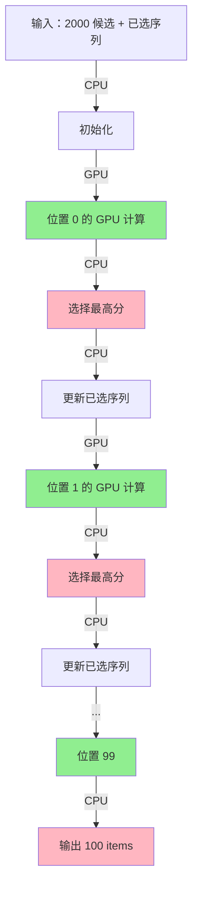
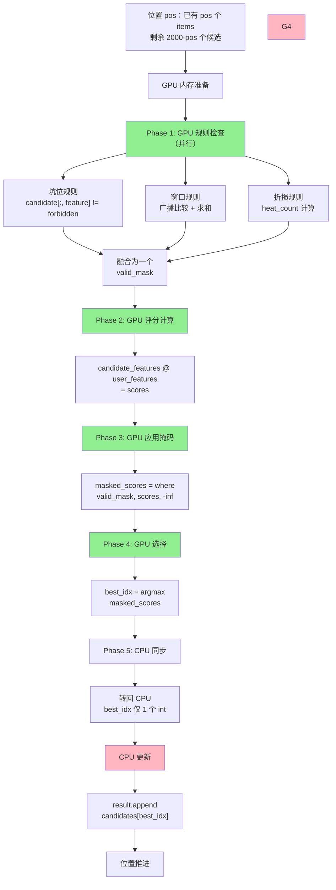
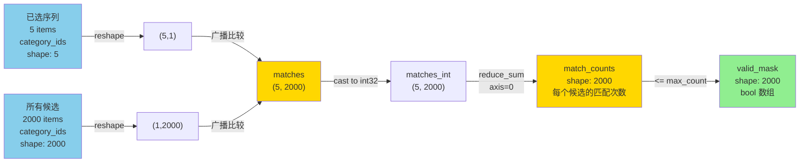
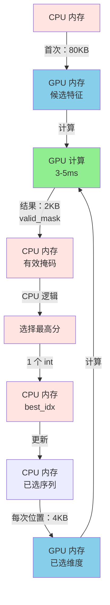
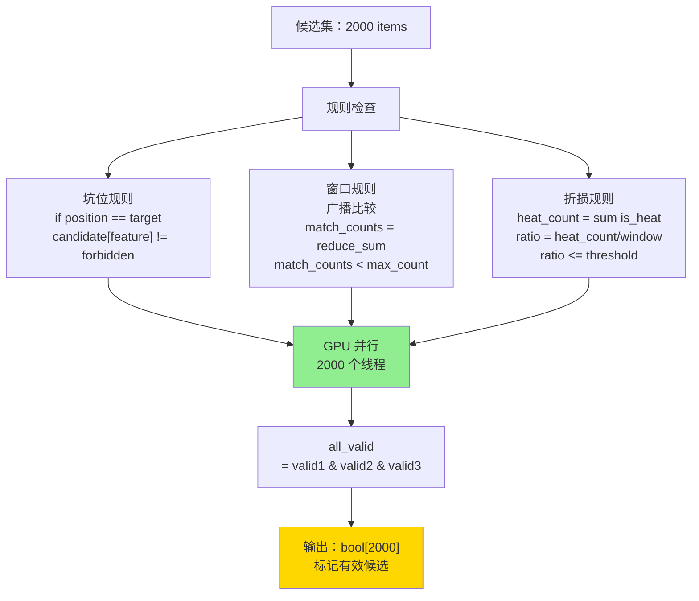
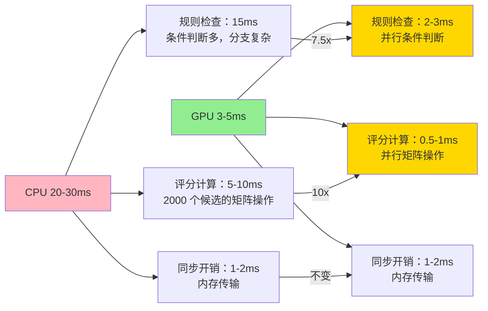

# TensorFlow GPU Beamsearch - 最小可行性分析

## 1. 问题

### 场景
- 推荐系统混排层 beamsearch
- 候选集：2000 items
- 输出：100-200 items
- 规则：位置相关的打散规则

### 目标
用 TensorFlow GPU 加速，从 **20-30ms 降到 < 5ms**（5-10 倍提升）

### 三类打散规则
1. **坑位过滤**：给定位置 + 上文 → 过滤候选
2. **窗口 M 出 N**：窗口内某维度最多出现 N 次
3. **定坑折损**：窗口内特定类型不超过 X%

---

## 2. TensorFlow 方案核心

### 为什么 TensorFlow？

**优势**：
- 自动图优化（操作融合、内存优化）
- 高效的向量操作（广播、reduce）
- 与推荐系统易集成（如已用 TF）
- 生产级支持（SavedModel、Serving）

**性能预期**：
- CPU 版本：20-30ms
- TensorFlow GPU：3-5ms
- 提升：5-10 倍

### 核心设计

**不能完全并行化**：
```
规则依赖性：位置 i 依赖位置 0..i-1 的结果
→ 必须串行推进位置
```

**但可以在每个位置并行**：
```
位置 0:
  ├─ GPU 并行：检查 2000 个候选
  ├─ GPU 并行：计算规则有效性
  └─ CPU：选择最高分 → 位置 1
  
位置 1:
  ├─ GPU 并行：检查 1999 个候选
  ├─ GPU 并行：计算规则有效性
  └─ CPU：选择最高分 → 位置 2
  
...
```

**GPU 特别快的操作**：
1. **广播比较**（20x）- 5 个已选 vs 2000 个候选
2. **向量求和**（10x）- 统计匹配结果
3. **条件判断**（7.5x）- 2000 个候选的规则检查

---

## 3. GPU 计算流程图

### 整体流程（GPU vs CPU）



### 单个位置的详细流程（GPU 并行）



### 窗口规则的 GPU 计算（最关键）



### 数据流转与同步



### 三类规则的 GPU 计算



### 性能瓶颈分析



---

## 4. TensorFlow 实现概述

### 伪代码

```python
import tensorflow as tf

@tf.function  # JIT 编译，自动优化
def beamsearch_step(result, candidates, position):
    # 已选序列（GPU 张量）
    result_dims = tf.constant(...)  # shape: (pos, num_features)
    
    # 所有候选（GPU 张量）
    candidate_dims = tf.constant(...)  # shape: (2000, num_features)
    
    # Phase 1: 规则检查（GPU）
    valid_mask = check_all_rules(result_dims, candidate_dims, position)
    
    # Phase 2: 评分计算（GPU）
    scores = compute_scores(candidate_dims)
    
    # Phase 3: 应用掩码
    masked_scores = tf.where(valid_mask, scores, -1e10)
    
    # Phase 4: 选择最高分
    best_idx = tf.argmax(masked_scores)
    
    return best_idx, scores, valid_mask

def check_all_rules(result_dims, candidate_dims, position):
    """GPU 上并行检查所有规则"""
    num_candidates = tf.shape(candidate_dims)[0]
    valid_mask = tf.ones(num_candidates, dtype=tf.bool)
    
    # 坑位规则
    if position == rule.position:
        valid_mask &= candidate_dims[:, 1] != forbidden_type
    
    # 窗口规则：广播比较 + 求和
    window_start = tf.maximum(0, tf.shape(result_dims)[0] - window_size + 1)
    result_window = result_dims[window_start:, dim]  # shape: (w,)
    
    # 广播比较：(w, 1) vs (1, 2000) → (w, 2000)
    matches = tf.equal(result_window[:, None], candidate_dims[None:, dim])
    
    # 沿 axis=0 求和
    match_counts = tf.reduce_sum(tf.cast(matches, tf.int32), axis=0)
    valid_mask &= match_counts < max_count
    
    # 折损规则
    if candidate.is_heat:
        heat_count = tf.reduce_sum(tf.cast(result_dims[:, 4], tf.bool))
        heat_ratio = (heat_count + 1) / tf.shape(result_dims)[0]
        valid_mask &= heat_ratio <= max_heat_ratio
    
    return valid_mask
```

### 关键优化

1. **@tf.function 编译**
   - 转换为静态计算图
   - 自动融合相邻操作
   - 性能提升 2-3 倍

2. **广播操作**
   - CPU 嵌套循环：O(w × 2000)，~10ms
   - TensorFlow 广播：O(1)，~0.5ms
   - 提升：20 倍

3. **最小化 CPU-GPU 同步**
   - 每个位置同步一次
   - 传输 2KB bool 掩码
   - 同步开销 < 1-2ms

4. **混合精度（可选）**
   - 条件判断用 int32/bool
   - 评分用 float16（可选）
   - 吞吐量提升 2-3 倍

---

## 5. 信息需求

### 必须提供

- [ ] **打散规则完整列表**
  ```
  - 规则 ID（如 "first_no_double"）
  - 规则类型（坑位/窗口/折损）
  - 具体参数
  - 优先级（如果有冲突）
  ```

- [ ] **候选 item 属性**
  ```
  已知的：
    - score, itemshowtype, category_id, bizuin, is_heat
  
  需要确认：
    - 还有其他维度吗？
    - 哪些是维度值（用于窗口规则）？
    - 哪些是标志位（用于条件判断）？
    - 总共多少个特征维度？
  ```

- [ ] **TensorFlow 环境**
  ```
  - TensorFlow 版本要求
  - GPU 类型和显存
  - 现有系统中 GPU 的使用情况
  ```

- [ ] **性能目标**
  ```
  - 目标延时：3-5ms 还是 < 2ms？
  - P99 要求：多少？
  - 吞吐量：QPS？
  ```

### 架构确认

- [ ] 现有推荐系统是否已用 TensorFlow？
- [ ] 是否有现成的 GPU 推理流程？
- [ ] 推荐模型的输出维度是多少？
- [ ] 是否需要支持 TensorFlow Serving 部署？

---

## 6. 预期与下一步

### 预期

| 指标 | 值 |
|------|-----|
| 性能提升 | 5-10 倍 |
| 延时 | 3-5ms |
| 开发周期 | 2-3 周 |
| 代码行数 | 300-500 行 |

### 下一步流程

1. **你提供信息** ← 现在
2. **我们设计 TensorFlow 方案**
3. **实现原型**
4. **性能基准测试**
5. **集成和部署**

---

## 问题清单（待回答）

将你的回答填入 markdown 复选框中。

### 打散规则
- [ ] 有几条规则？
- [ ] 每条规则的具体定义？
- [ ] 规则之间有优先级吗？
- [ ] 规则是否动态变化？

### 候选 Item
- [ ] 总共多少个维度？
- [ ] 哪些维度用于窗口规则？
- [ ] 是否需要特殊的内存对齐？
- [ ] 特征向量是否预计算好了？

### 系统架构
- [ ] 现有系统是否用 TensorFlow？
- [ ] 推荐模型输出格式？
- [ ] GPU 显存约束？
- [ ] 是否需要 TensorFlow Serving？

### 性能要求
- [ ] 目标延时是多少？
- [ ] P99 要求是多少？
- [ ] 是否需要支持多 GPU？
- [ ] 是否需要支持批处理？

---

**准备好了吗？提供上面的信息，我们开始设计和实现！** 🚀
